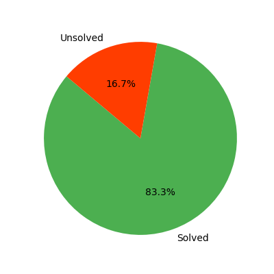

# LeetCode Progress Tracker 🚀

## 📊 Progress Overview
- **Total Problems**: 24
- **Total Solved**: 24
- **Progress:** [████████████████████] 24/24 solved

## 📌 Problem List
| #  | Problem | Category | Difficulty | Time Taken | Attempts | Hints Used | Notes | Status |
|----|---------|----------|------------|------------|----------|------------|-------|--------|
| 1 | Counting Bits: https://leetcode.com/problems/counting-bits/description/ | Bit Manipulation | Easy | 20 min | 1 | Yes | Used a helper function to count the number of 1 bits in a number. Use the operation n & (n - 1) to count the number of 1 bits in a number. | Solved |
| 2 | Single Number | Bit Manipulation | Easy | 5 min | 1 | No | Used XOR to solve the problem. It permits us to find the unique number in the list. Why ? Because XOR of a number with itself is 0. So, if we XOR all the numbers in the list, we will be left with the unique number. | Solved |
| 3 | Binary Search – https://leetcode.com/problems/binary-search/ | Binary Search | Easy | 10 min | 1 | No |  | Solved |
| 4 | Valid Parentheses: https://leetcode.com/problems/valid-parentheses/ | Stacks | Easy | 20 min | 1 | No |  | Solved |
| 5 | Min Stack: https://leetcode.com/problems/min-stack/ | Stacks | Medium | 20 min | 1 | No |  | Solved |
| 6 | Evaluate Reverse Polish Notation: https://leetcode.com/problems/evaluate-reverse-polish-notation | Stacks | Medium | 30 min | 1 | No |  | Solved |
| 7 | Group Anagrams: https://leetcode.com/problems/group-anagrams/ | Arrays & HashMaps | Medium | 40 min | 5 | Yes | Store in the hash_map all anagram by using the word sorted as key. | Solved |
| 8 | Top K Frequent Elements: https://leetcode.com/problems/top-k-frequent-elements/ | Arrays & HashMaps | Easy | 20 min | 1 | No | We use a hash_map to store the number of time an element appear in the array. Then we sort this map by the number of time they appear and return the number of elements asked by k. | Solved |
| 9 | Two Sum: https://leetcode.com/problems/two-sum | Arrays & HashMaps | Easy | 10 min | 1 | No | We use a hash_map to store the difference between the target and the current number as a key and the index as a value. We have to check if the current num is not already in the hash_map because if it's the case it means we have a sum of two elements that gives the target (hash_map[nums[i]] and i). | Solved |
| 10 | Product Of Array Except Self: https://leetcode.com/problems/product-of-array-except-self/ | Arrays & HashMaps | Medium | 40 min | 5 | Yes | Use a prefix and postfix to calculate the product. | Solved |
| 11 | Encode And Decode Tiny URL: https://leetcode.com/problems/encode-and-decode-tinyurl/ | Arrays & HashMaps | Medium | 8 min | 1 | No | Use a dictionnary to store the correspondance between the encoded key and the long url. This code can be improve by adding an other hash_map to verify if the url hasn't already encoded, and by verifying if the key wasn't already used even tough the probability is very low. | Solved |
| 12 | Contains Duplicate: https://leetcode.com/problems/contains-duplicate/ | Arrays & HashMaps | Easy | 5 min | 2 | No | Use a set to get only unique letters. If the length is not the same it means there are duplicates. | Solved |
| 13 | Counting Bits: https://leetcode.com/problems/isomorphic-strings/description/ | Arrays & HashMaps | Easy | 20 min | 2 | Yes | Use a hashmap to store the mapping of characters from s to t. If a character in s is already in the hashmap, check if the mapping is the same as the current character in t. If not, return False. If the current character in t is already in the hashmap, return False. Otherwise, add the mapping to the hashmap. | Solved |
| 14 | Contains Duplicate II: https://leetcode.com/problems/contains-duplicate-ii/ | Arrays & HashMaps | Easy | 20 min | 2 | No | Use a hashmap to implement the solution in O(n) time. Store the index of the last occurence of each number in the hashmap. If the difference between the current index and the last occurence is less than or equal to k, return True. Otherwise, update the last occurence of the number in the hashmap. | Solved |
| 15 | Longest Consecutive Sequence: https://leetcode.com/problems/longest-consecutive-sequence | Arrays & HashMaps | Medium | 15 min | 1 | No | Use a set to store unique values from the input list for O(1) lookups. Iterate through the set and only start counting sequences from numbers that have no predecessor (num - 1 not in set). Expand the sequence by counting consecutive numbers (num + 1) in the set. | Solved |
| 16 | Two Sum: https://leetcode.com/problems/two-sum | Arrays & HashMaps | Easy | 10 min | 1 | No | Use a dictionnary with set values to store unique numbers of each cols, rows and squares. If the element is found in it return false. To manage square we use: squares[(r // 3, c // 3)] that identifies each 3x3 box by its row and column group and keeps track of seen digits in that box. | Solved |
| 17 | Subarray Sum Equals K | PrefixSum | Medium | 1h+ | 4 | Yes |  | Solved |
| 18 | Range Sum Query - Immutable: https://leetcode.com/problems/range-sum-query-immutable/ | PrefixSum | Easy | 20 min | 1 | No |  | Solved |
| 19 | Valid Anagram: https://leetcode.com/problems/valid-anagram/ | Strings | Easy | 20 min | 1 | No | Use hash_map to store distinct letters with the number of time they're appearing in the string. If equals it means it's an anagram. | Solved |
| 20 | Valid Palindrome: https://leetcode.com/problems/valid-palindrome/ | Strings | Easy | 7 min | 1 | No | Use a set for valid_letters. Compare left letter and right letter to chech if it's a palindrome. | Solved |
| 21 | Two Sum II - Input Array Is Sorted: https://leetcode.com/problems/two-sum-ii-input-array-is-sorted | TwoPointers | Medium | 10 min | 2 | Yes | Use two pointers, one at the start and one at the end. Move the pointers left or right based on the sum, taking advantage of the sorted order of the array. | Solved |
| 22 | Trapping Rain Water: https://leetcode.com/problems/trapping-rain-water | TwoPointers | Hard | 22 min | 1 | No |  | Solved |
| 23 | Container with most water: https://leetcode.com/problems/container-with-most-water | TwoPointers | Medium | 10 min | 1 | No |  | Solved |
| 24 | 3Sum: https://leetcode.com/problems/3sum | TwoPointers | Medium | 34 min | 2 | Yes |  | Solved |
