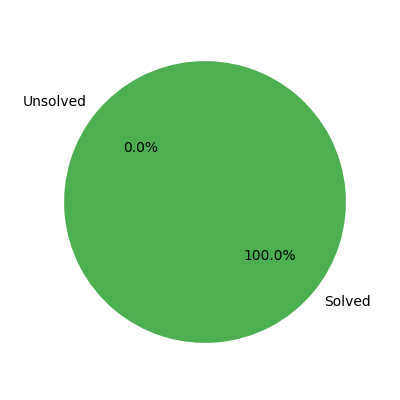

# LeetCode Progress Tracker 🚀

## 📊 Progress Overview
- **Total Problems**: 4
- **Total Solved**: 3
- **Progress:** [███████████████-----] 3/4 solved

## 📌 Problem List
| #  | Problem | Category | Difficulty | Time Taken | Attempts | Hints Used | Notes | Status |
|----|---------|----------|------------|------------|----------|------------|-------|--------|
| 1 | Valid Palindrome | Strings | Easy | 15 min | 2 | No | None | Solved |
| 2 | Problem 1 | Arrays | Easy | 15 min | 1 | No | Used a dictionary to store seen numbers. | Unsolved |
| 3 | Counting Bits: https://leetcode.com/problems/counting-bits/description/ | Bit Manipulation | Easy | 20 min | 1 | Yes | Used a helper function to count the number of 1 bits in a number. Use the operation n & (n - 1) to count the number of 1 bits in a number. | Solved |
| 4 | Single Number | Bit Manipulation | Easy | 5 min | 1 | No | Used XOR to solve the problem. It permits us to find the unique number in the list. Why ? Because XOR of a number with itself is 0. So, if we XOR all the numbers in the list, we will be left with the unique number. | Solved |
